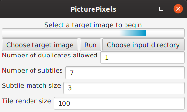

# Picture Pixels
This application can compose images out of a whole directory of images in a mosaic-like fashion.

##### Note
This application can be very CPU intensive and also consume a lot of memory. Sometimes exceeding the JVM default maximum allowed amount. To overcome this, launch the application with the java argument `-Xmx4g` for example allowing 4GB of memory to be allocated.


## Screenshot


## Command Line Usage
This application can also be used without the GUI.

Usage: ```java [-Xmx4g] -jar PicturePixels.jar nogui run|info <target image> <input directory> <number of duplicates allowed> <number of subtiles> <subtile match size> <tile render size> <output file>```